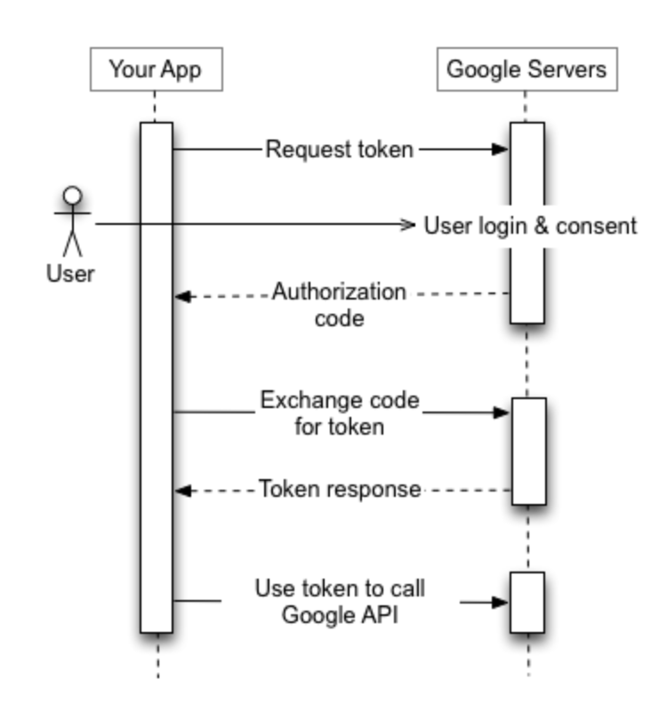

# 소셜 로그인 (Google OAuth 2.0)

## 1️⃣ Google API 사용


### 📌 Front-end
1. 사용자가 로그인 및 권한 허용
   - URL 예시
     ```plaintext
     https://accounts.google.com/o/oauth2/v2/auth?
     client_id={CLIENT_ID}&
     redirect_uri={REDIRECT_URI}&
     response_type=code&
     scope=https://www.googleapis.com/auth/userinfo.email&
     access_type=online&
     state={RANDOM_STRING

2. 구글 OAuth 서버로부터 인가 코드 발급
3. 인가 코드를 쿼리 파라미터에 포함하여 백엔드 소셜 로그인 API 호출

### 🖥️ Back-end
1. 구글 OAuth 서버에 인가 코드, 클라이언트 정보 등을 포함하여 액세스 토큰 등 요청
2. **액세스 토큰을 사용하여 구글 API에서 사용자 정보 요청**
3. DB에서 회원 여부 확인 및 처리
   - 가입된 회원이면 로그인 처리
   - 신규 회원이면 회원 등록 후 로그인 처리
4. JWT 인증 방식 적용
   - 액세스 토큰 & 리프레시 토큰 생성
   - 프론트엔드에 전달하여 인증 처리

## 2️⃣ id_token 디코딩 방식

### 📌 Front-end
1. 사용자가 로그인 및 권한 허용 (예시 생략)
2. 구글 OAuth 서버로부터 인가 코드 발급
3. 인가 코드를 쿼리 파라미터에 포함하여 백엔드 소셜 로그인 API 호출

### 🖥️ Back-end
1. 구글 OAuth 서버에 인가 코드, 클라이언트 정보 등을 포함하여 id_token 등 요청
2. **id_token 디코딩하여 사용자 정보 추출**
3. DB에서 회원 여부 확인 및 처리
   - 가입된 회원이면 로그인 처리
   - 신규 회원이면 회원 등록 후 로그인 처리
4. JWT 인증 방식 적용
   - 액세스 토큰 & 리프레시 토큰 생성
   - 프론트엔드에 전달하여 인증 유지

## 🔗 참고 자료
- [Google OAuth 2.0 공식 문서](https://developers.google.com/identity/protocols/oauth2/web-server?hl=ko#httprest)
